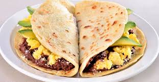

# Mario Vargas

My favorite food is called Baleadas. Baleadas is a traditional food in Honduras. It's a big tortilla filled with beans, cream, and meat of your choice. 
Baleadas are my favorite food because it was something my mom always made for me as a kid. I recommend that people try the Baleadas if they visit Honduras.

